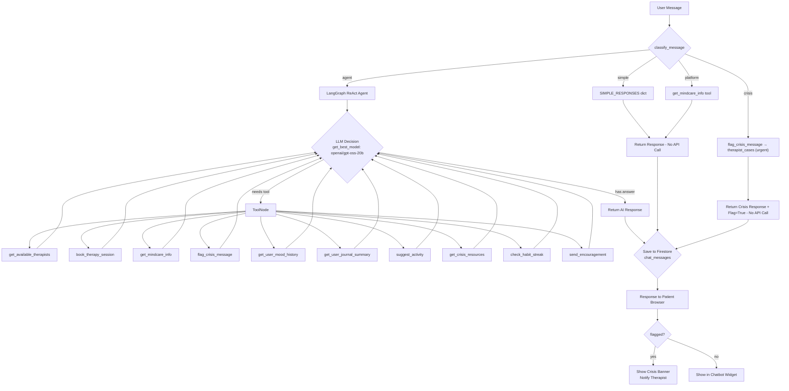

# MindCare LangGraph Agent Flow

```mermaid
flowchart TD
    A[User Message] --> B{classify_message}

    B -->|simple| C[SIMPLE_RESPONSES dict]
    B -->|platform| D[get_mindcare_info tool]
    B -->|crisis| E["flag_crisis_message → therapist_cases (urgent)"]
    B -->|agent| F[LangGraph ReAct Agent]

    C --> Z[Return Response - No API Call]
    D --> Z
    E --> Y[Return Crisis Response + Flag=True - No API Call]

    F --> G{LLM Decision\nget_best_model: openai/gpt-oss-20b}

    G -->|needs tool| H[ToolNode]
    G -->|has answer| X[Return AI Response]

    H --> T1[get_available_therapists]
    H --> T2[book_therapy_session]
    H --> T3[get_mindcare_info]
    H --> T4[flag_crisis_message]
    H --> T5[get_user_mood_history]
    H --> T6[get_user_journal_summary]
    H --> T7[suggest_activity]
    H --> T8[get_crisis_resources]
    H --> T9[check_habit_streak]
    H --> T10[send_encouragement]

    T1 --> G
    T2 --> G
    T3 --> G
    T4 --> G
    T5 --> G
    T6 --> G
    T7 --> G
    T8 --> G
    T9 --> G
    T10 --> G

    X --> W{Save to Firestore\nchat_messages}
    Z --> W
    Y --> W
    W --> V[Response to Patient Browser]

    V --> U{flagged?}
    U -->|yes| S[Show Crisis Banner\nNotify Therapist]
    U -->|no| R[Show in Chatbot Widget]
```
