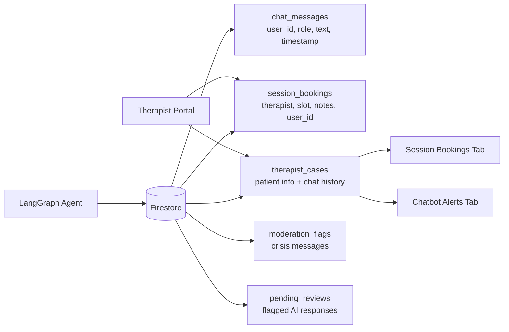

# MindCare Firestore Writes

```mermaid
flowchart LR
    Agent[LangGraph Agent] --> FS[(Firestore)]

    FS --> CM[chat_messages\nuser_id, role, text, timestamp]
    FS --> SB[session_bookings\ntherapist, slot, notes, user_id]
    FS --> TC[therapist_cases\npatient info + chat history]
    FS --> MF[moderation_flags\ncrisis messages]
    FS --> PR[pending_reviews\nflagged AI responses]

    Portal[Therapist Portal] --> TC
    Portal --> SB

    TC --> TAB1[Session Bookings Tab]
    TC --> TAB2[Chatbot Alerts Tab]
```
