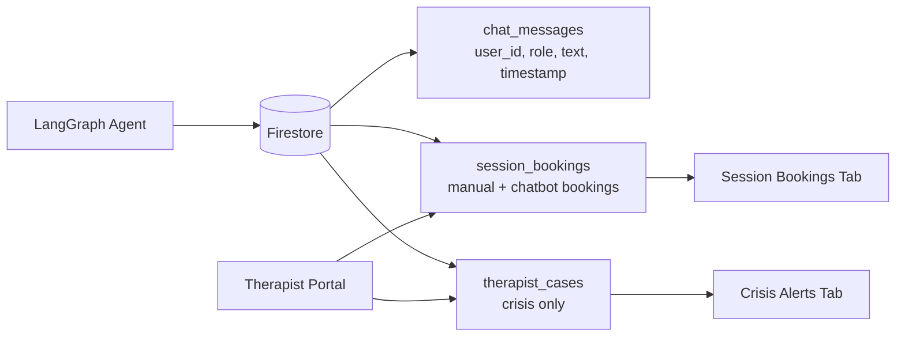

# MindCare Firestore Writes

```mermaid
flowchart LR
    Agent[LangGraph Agent] --> FS[(Firestore)]

    FS --> CM[chat_messages\nuser_id, role, text, timestamp]
    FS --> SB[session_bookings\nmanual + chatbot bookings]
    FS --> TC[therapist_cases\ncrisis only]

    Portal[Therapist Portal] --> TC
    Portal --> SB

    SB --> TAB1[Session Bookings Tab]
    TC --> TAB2[Crisis Alerts Tab]
```

Removed collections: `moderation_flags` (no longer written; crisis flags go to `therapist_cases`) and
`pending_reviews` (removed; no longer part of the flow).
